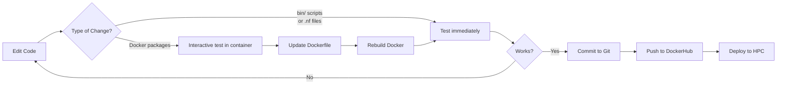

# Developer's Guide

**Complete guide for developing and maintaining the longitudinal-GWAS-pipeline**

This guide covers everything from quick script edits to full Docker rebuilds, testing strategies, and deployment workflows.

---

## Table of Contents

1. [Quick Start for Developers](#quick-start-for-developers)
2. [Development Workflow](#development-workflow)
3. [What Changes Require What Actions](#what-changes-require-what-actions)
4. [Interactive Development](#interactive-development)
5. [Docker Development](#docker-development)
6. [Biowulf (HPC) Development](#biowulf-hpc-development)
7. [Testing Strategy](#testing-strategy)
8. [Deployment Pipeline](#deployment-pipeline)
9. [Troubleshooting](#troubleshooting)

---

## Quick Start for Developers

### Clone and Setup

```bash
# Clone the repository
git clone https://github.com/hirotaka-i/long-gwas-pipeline.git
cd long-gwas-pipeline

# Test with existing Docker image (no build needed)
nextflow run main.nf -profile standard -params-file params.yml

# Or build local Docker image for testing
docker build --platform linux/amd64 -f Dockerfile.ubuntu22 -t longgwas-local-test .
nextflow run main.nf -profile localtest -params-file params.yml
```

### Daily Development Commands

```bash
# Edit bin/ scripts (immediate effect, no rebuild)
vim bin/manhattan.py
nextflow run main.nf -profile standard -params-file params.yml

# Edit workflow files (immediate effect, no rebuild)
vim workflows/gwas.nf
nextflow run main.nf -profile standard -params-file params.yml

# Test in interactive Docker shell
docker run -it --rm --platform linux/amd64 -v $PWD:/workspace -w /workspace longgwas-local-test /bin/bash
```

---

## Development Workflow

### The Golden Rule

**Fast iteration → Test → Commit → Deploy**



### Recommended Development Cycle

1. **Quick changes** (bin/ scripts, .nf files)
   - Edit locally
   - Test with `-profile standard` or `-profile localtest`
   - Commit when working

2. **Container changes** (R/Python packages)
   - Test interactively in container first
   - Update Dockerfile only when confirmed working
   - Rebuild, test, push to DockerHub
   - Deploy to production environments (Biowulf, etc.)

---

## What Changes Require What Actions

### ✅ Immediate Effect (No Rebuild)

These changes are reflected immediately when you run the pipeline:

| File Type | Examples | Why Immediate? |
|-----------|----------|----------------|
| **Python scripts** | `bin/manhattan.py`, `bin/qc.py`, `bin/gallop.py` | Nextflow auto-mounts `bin/` directory |
| **R scripts** | `bin/survival.R` | Same - mounted at runtime |
| **Shell scripts** | `bin/process1.sh`, `bin/download_references.sh` | Same - mounted at runtime |
| **Nextflow workflows** | `workflows/gwas.nf`, `main.nf` | Nextflow reads directly from host |
| **Nextflow modules** | `modules/**/*.nf` | Same - read at runtime |
| **Nextflow subworkflows** | `subworkflows/*.nf` | Same - read at runtime |
| **Configuration** | `nextflow.config`, `params.yml` | Read at pipeline startup |

**Development Pattern:**
```bash
# Edit the file
vim bin/manhattan.py

# Run immediately - changes take effect
nextflow run main.nf -profile standard -params-file params.yml
```

### 🔧 Requires Docker Rebuild

These changes require rebuilding the Docker image:

| Change Type | Examples | Action Required |
|-------------|----------|-----------------|
| **Python packages** | Adding `scikit-learn`, upgrading `pandas` | Edit Dockerfile → Rebuild |
| **R packages** | Adding `ggplot2`, upgrading `survival` | Edit Dockerfile → Rebuild |
| **System packages** | Adding `cmake`, `git`, etc. | Edit Dockerfile → Rebuild |
| **Bioinformatics tools** | Updating `plink`, `bcftools`, etc. | Edit Dockerfile → Rebuild |
| **Reference files** | Adding genome references | Edit Dockerfile → Rebuild |
| **Python/R base versions** | Upgrading Python 3.10 → 3.11 | Edit Dockerfile → Rebuild |

**Development Pattern:**
```bash
# 1. Test interactively first (see next section)
docker run -it --rm --platform linux/amd64 -v $PWD:/workspace -w /workspace longgwas-local-test /bin/bash

# 2. Edit Dockerfile when confirmed working
vim Dockerfile.ubuntu22

# 3. Rebuild
docker build --platform linux/amd64 -f Dockerfile.ubuntu22 -t longgwas-local-test .

# 4. Test the rebuilt image
nextflow run main.nf -profile localtest -params-file params.yml
```

---

## Interactive Development

**The fastest way to test package changes before committing to a rebuild.**

### On Mac (Docker)

```bash
# Start interactive shell in container
docker run -it --rm \
  --platform linux/amd64 \
  -v $PWD:/workspace \
  -w /workspace \
  longgwas-local-test \
  /bin/bash

# Now you're inside the container
root@container:/workspace#
```

### On Biowulf (Singularity)

```bash
# SSH to Biowulf
ssh biowulf.nih.gov

# Load modules
module load singularity

# Start interactive shell
singularity shell --bind $PWD $LONG_GWAS_DIR/Docker/gwas-pipeline_survival.sif

# Now you're inside the container
Singularity>
```

### Inside Container: Common Tasks

#### Test R Packages

```r
# Start R
R

# Install package
> install.packages("ggplot2", repos="https://cloud.r-project.org")

# Test it works
> library(ggplot2)
> p <- ggplot(mtcars, aes(mpg, hp)) + geom_point()
> print(p)

# Exit R
> quit()
```

#### Test Python Packages

```bash
# Install package
pip install scikit-learn

# Test it works
python -c "import sklearn; print(sklearn.__version__)"

# Test with your data
python bin/your_analysis.py
```

#### Test Your bin/ Scripts

```bash
# bin/ is already mounted, test directly
python bin/manhattan.py --help
Rscript bin/survival.R --help

# Run your test workflow
./test_packages.sh  # If you created this script
```

#### Exit Container

```bash
# Docker
exit

# Singularity
exit
```

### Creating a Test Script

Create `test_packages.sh` for quick validation:

```bash
#!/bin/bash
# Test all required packages and tools

echo "=== Testing R packages ==="
R --quiet --no-save -e '
  required_pkgs <- c("survival", "optparse")
  for (pkg in required_pkgs) {
    if (!require(pkg, character.only = TRUE, quietly = TRUE)) {
      stop(paste("Missing R package:", pkg))
    }
    cat(sprintf("✓ %s: %s\n", pkg, packageVersion(pkg)))
  }
'

echo -e "\n=== Testing Python packages ==="
python3 << 'EOF'
import sys
packages = {
    "pandas": "2.1.4",
    "numpy": "1.26.0", 
    "scipy": "1.10.1",
    "tables": "3.10.1"
}
for pkg, expected in packages.items():
    try:
        mod = __import__(pkg)
        version = getattr(mod, "__version__", "unknown")
        print(f"✓ {pkg}: {version}")
    except ImportError:
        print(f"✗ {pkg}: MISSING", file=sys.stderr)
        sys.exit(1)
EOF

echo -e "\n=== Testing bioinformatics tools ==="
for tool in plink plink2 bcftools liftOver gcta64; do
  if command -v $tool &> /dev/null; then
    echo "✓ $tool: available"
  else
    echo "✗ $tool: MISSING"
    exit 1
  fi
done

echo -e "\n=== Testing bin/ scripts ==="
for script in bin/manhattan.py bin/qc.py bin/gallop.py; do
  if [ -f "$script" ]; then
    echo "✓ $script: exists"
  else
    echo "✗ $script: MISSING"
    exit 1
  fi
done

echo -e "\n✅ All tests passed!"
```

Make it executable:
```bash
chmod +x test_packages.sh
```

Use in interactive container:
```bash
./test_packages.sh
```

---

## Docker Development

### Building the Docker Image

#### For Apple Silicon (M1/M2/M3 Macs)

**CRITICAL**: Always use `--platform linux/amd64`

```bash
# The pipeline uses x86_64 binaries (liftOver, plink, etc.)
# Building for arm64 will cause "Rosetta error" or "exec format error"
docker build --platform linux/amd64 -f Dockerfile.ubuntu22 -t longgwas-local-test .
```

#### For Intel Macs / Linux

```bash
docker build -f Dockerfile.ubuntu22 -t longgwas-local-test .
```

### Dockerfile Architecture

The `Dockerfile.ubuntu22` is organized for **maximum cache efficiency**:

```dockerfile
# Layer 1: Base system (slowest, most stable)
FROM ubuntu:22.04
RUN apt-get update && apt-get install ...

# Layer 2: R packages (slow, stable)
RUN Rscript -e 'install.packages(c("survival", "optparse"))'

# Layer 3: Google Cloud SDK (slow, stable)
RUN apt-get install google-cloud-cli

# Layer 4: Compiled tools (moderate speed, stable)
RUN wget bcftools... && make && make install

# Layer 5: Downloaded binaries (fast, stable)
COPY docker/build-artifacts/*.zip
RUN unzip plink...

# Layer 6: Python packages (moderate speed, less stable)
RUN pip install numpy scipy pandas statsmodels

# Layer 7: Fast-changing packages (fastest, most volatile)
RUN pip install tables  # PyTables - added last for cache efficiency
```

**Why this order?**
- Docker caches layers from top to bottom
- When you change a layer, all layers below it are rebuilt
- Put slow, stable things at the top
- Put fast, changing things at the bottom

### Adding Packages to Dockerfile

#### R Packages (CRAN)

Add to line ~31 in `Dockerfile.ubuntu22`:

```dockerfile
# Install R packages from CRAN
RUN Rscript -e 'install.packages(c("survival", "optparse", "ggplot2", "YOUR_NEW_PACKAGE"), repos="https://cloud.r-project.org")'
```

#### R Packages (Bioconductor)

Add after CRAN packages:

```dockerfile
# Install Bioconductor packages
RUN Rscript -e 'if (!requireNamespace("BiocManager", quietly = TRUE)) install.packages("BiocManager"); BiocManager::install(c("GenomicRanges", "YOUR_BIOC_PACKAGE"))'
```

#### Python Packages

Add to line ~139 in `Dockerfile.ubuntu22`:

```dockerfile
# Install Python packages
RUN pip install --no-cache-dir \
    numpy==1.26.0 \
    scipy==1.10.1 \
    pandas==2.1.4 \
    statsmodels==0.14.4 \
    matplotlib==3.7.5 \
    seaborn==0.13.2 \
    your_new_package==1.0.0
```

For fast-changing packages, add as separate layer at the end:

```dockerfile
# Fast-changing package (for cache efficiency)
RUN pip install --no-cache-dir your_experimental_package
```

#### System Packages

Add to line ~11 in `Dockerfile.ubuntu22`:

```dockerfile
RUN apt-get update && apt-get install -y --no-install-recommends \
    ca-certificates netbase wget curl unzip git \
    build-essential cmake gcc g++ make \
    your-new-system-package \
    && rm -rf /var/lib/apt/lists/*
```

### Testing Docker Image

```bash
# Test the image directly
docker run --rm longgwas-local-test R -e 'library(survival)'
docker run --rm longgwas-local-test python -c 'import pandas'

# Test with pipeline
nextflow run main.nf -profile localtest -params-file params.yml

# Test interactively
docker run -it --rm --platform linux/amd64 -v $PWD:/workspace -w /workspace longgwas-local-test /bin/bash
```

### Build Time Optimization

**First build** (no cache):
```
610 seconds (~10 minutes)
```

**Rebuild after bin/ change** (full cache):
```
6 seconds (uses all cached layers)
```

**Rebuild after Python package change** (partial cache):
```
~60 seconds (rebuilds from Python layer down)
```

**Rebuild after R package change** (minimal cache):
```
~300 seconds (rebuilds from R layer down)
```

**Pro tip**: Group related changes together to minimize rebuilds.

---

## Biowulf (HPC) Development

### Environment Setup

```bash
# Set environment variables (add to ~/.bashrc)
export LONG_GWAS_DIR=/data/your-lab/your-username/long-gwas
export PROJECT_NAME=my-gwas-project

# Load modules
module load nextflow singularity
```

### Converting Docker to Singularity

```bash
# Build Singularity image from Docker Hub
singularity build $LONG_GWAS_DIR/Docker/gwas-pipeline_survival.sif \
  docker://your-username/longgwas:v3

# Or from local Docker image (requires Docker on Biowulf - usually not available)
# Better to push to DockerHub first, then pull
```

### Testing on Biowulf

```bash
# Interactive test
singularity shell --bind $PWD $LONG_GWAS_DIR/Docker/gwas-pipeline_survival.sif

# Pipeline test
nextflow run main.nf -profile biowulf -params-file params.yml
```

### Biowulf-Specific Configuration

From `nextflow.config` (lines 145-195):

```groovy
biowulf {
  params {
    store_dir = "$LONG_GWAS_DIR/Data/Cache"
  }
  env {
    RESOURCE_DIR = '/files'
    OUTPUT_DIR = "$LONG_GWAS_DIR/$PROJECT_NAME/results"
    STORE_DIR = "$LONG_GWAS_DIR/Data/Cache"
    ADDI_QC_PIPELINE = '/usr/src/ADDI-GWAS-QC-pipeline/addi_qc_pipeline.py'
  }
  process {
    container = "$LONG_GWAS_DIR/Docker/gwas-pipeline_survival.sif"
    
    withLabel: small {
      cpus = 2
      memory = '5 GB'
    }
    withLabel: medium {
      cpus = 2
      memory = '15 GB'
    }
    withLabel: large_mem {
      cpus = 10
      memory = '115 GB'
    }
  }
  executor {
    cpus = 20
    name = 'local'
    memory = '125 GB'
  }
  singularity {
    enabled = true
    temp = 'auto'
    runOptions = "--bind $PWD --env APPEND_PATH=$PWD/bin"
  }
}
```

**Key differences from local Docker:**
- Uses **Singularity** instead of Docker
- Much larger resources (115 GB for large_mem vs 12 GB local)
- Requires environment variables set
- Uses `.sif` file instead of Docker image

---

## Testing Strategy

### Level 1: Quick Sanity Tests

```bash
# Test with example data (3 chromosomes, fast)
nextflow run main.nf -profile localtest -params-file params.yml

# Expected: ~36 processes, ~4 minutes
# Output: Manhattan plots in files/longGWAS_pipeline/results/
```

### Level 2: Package Tests

Create `test_packages.sh` (see [Interactive Development](#creating-a-test-script))

```bash
# Inside container
./test_packages.sh
```

### Level 3: Full Integration Tests

```bash
# Test all three analysis types
nextflow run main.nf -profile localtest --linear_flag true --phenofile example/phenotype.cs.tsv
nextflow run main.nf -profile localtest --longitudinal_flag true --phenofile example/phenotype.lt.tsv
nextflow run main.nf -profile localtest --survival_flag true --phenofile example/phenotype.surv.tsv
```

### Level 4: Real Data Tests

```bash
# Test with full genome data on Biowulf
nextflow run main.nf -profile biowulf \
  --input '/data/project/genotypes/chr*.vcf' \
  --phenofile phenotypes.tsv \
  --covarfile covariates.tsv
```

### Continuous Testing Checklist

Before committing changes:

- [ ] `test_packages.sh` passes
- [ ] Quick sanity test with example data passes
- [ ] At least one full analysis type completes successfully
- [ ] Manhattan plots are generated correctly
- [ ] No errors in `.nextflow.log`

Before pushing to DockerHub:

- [ ] All tests pass with `localtest` profile
- [ ] Docker image size is reasonable (<15 GB)
- [ ] Build time is acceptable (<15 minutes)

Before deploying to production (Biowulf):

- [ ] Full integration test passes
- [ ] Real data test on subset of chromosomes
- [ ] Singularity conversion successful
- [ ] Biowulf-specific resource limits tested

---

## Deployment Pipeline

### Full Deployment Workflow

```bash
# 1. Develop locally
vim bin/manhattan.py
vim Dockerfile.ubuntu22

# 2. Interactive testing
docker run -it --rm --platform linux/amd64 -v $PWD:/workspace -w /workspace longgwas-local-test /bin/bash
./test_packages.sh
exit

# 3. Rebuild Docker
docker build --platform linux/amd64 -f Dockerfile.ubuntu22 -t longgwas-local-test .

# 4. Test locally
nextflow run main.nf -profile localtest -params-file params.yml

# 5. Tag for DockerHub
docker tag longgwas-local-test your-username/longgwas:v3

# 6. Push to DockerHub
docker login
docker push your-username/longgwas:v3

# 7. Update configuration (if using new image name)
vim nextflow.config
# Change: process.container = 'your-username/longgwas:v3'

# 8. Commit to Git
git add .
git commit -m "Add ggplot2 package and improve Manhattan plots"
git push origin main

# 9. Deploy to Biowulf
ssh biowulf.nih.gov
module load singularity
singularity build $LONG_GWAS_DIR/Docker/gwas-pipeline_survival.sif \
  docker://your-username/longgwas:v3

# 10. Test on Biowulf
nextflow run main.nf -profile biowulf -params-file params.yml
```

### Version Tagging Strategy

Use semantic versioning:

```bash
# Major version (breaking changes)
docker tag longgwas-local-test your-username/longgwas:v3.0.0
docker tag longgwas-local-test your-username/longgwas:v3

# Minor version (new features)
docker tag longgwas-local-test your-username/longgwas:v2.1.0
docker tag longgwas-local-test your-username/longgwas:v2

# Patch version (bug fixes)
docker tag longgwas-local-test your-username/longgwas:v2.0.1

# Also tag as latest
docker tag longgwas-local-test your-username/longgwas:latest

# Push all tags
docker push your-username/longgwas:v3.0.0
docker push your-username/longgwas:v3
docker push your-username/longgwas:latest
```

---

## Troubleshooting

### Docker Build Issues

#### Problem: "Rosetta error: failed to open elf at /lib64/ld-linux-x86-64.so.2"

**Cause**: Built for wrong platform (arm64 instead of amd64)

**Solution**:
```bash
docker build --platform linux/amd64 -f Dockerfile.ubuntu22 -t longgwas-local-test .
```

**Verify platform**:
```bash
docker inspect longgwas-local-test | grep Architecture
# Should show: "Architecture": "amd64"
```

#### Problem: "ModuleNotFoundError: No module named 'tables'"

**Cause**: Missing Python package in Docker image

**Solution**: Add to Dockerfile and rebuild:
```dockerfile
RUN pip install --no-cache-dir tables
```

#### Problem: Docker build is very slow

**Cause**: No cache hits due to layer changes

**Solutions**:
1. Put slow-changing packages early in Dockerfile
2. Use `--no-cache` only when necessary
3. Use Docker BuildKit for parallel builds:
   ```bash
   DOCKER_BUILDKIT=1 docker build --platform linux/amd64 -f Dockerfile.ubuntu22 -t longgwas-local-test .
   ```

### Runtime Issues

#### Problem: "Permission denied" on bin/ scripts

**Solution**:
```bash
chmod +x bin/*.py bin/*.sh bin/*.R
```

#### Problem: bin/ scripts not found in container

**Cause**: Nextflow not mounting bin/ directory properly

**Check**:
```bash
# In nextflow.config, ensure:
singularity {
  runOptions = "--bind $PWD --env APPEND_PATH=$PWD/bin"
}

# Or in Docker:
docker {
  enabled = true
  temp = 'auto'
  # Nextflow automatically mounts $PWD
}
```

#### Problem: Out of memory errors

**Solution**: Increase memory in `nextflow.config`:
```groovy
withLabel: large_mem {
  cpus = 10
  memory = '200 GB'  // Increased from 115 GB
}
```

### Nextflow Issues

#### Problem: "Process X failed" but no clear error

**Solution**: Check detailed logs:
```bash
# View full log
cat .nextflow.log

# View specific process log
cat work/XX/XXXXXXXXX/.command.log

# Run with verbose output
nextflow run main.nf -profile localtest -params-file params.yml -with-trace -with-report
```

#### Problem: "Cached" processes not re-running after changes

**Solution**: Remove Nextflow cache:
```bash
# Remove work directory
rm -rf work/

# Or use -resume flag with new hash
nextflow run main.nf -profile localtest -params-file params.yml -resume
```

### Biowulf-Specific Issues

#### Problem: "Singularity not found"

**Solution**:
```bash
module load singularity
```

#### Problem: Environment variables not set

**Solution**:
```bash
# Check current values
echo $LONG_GWAS_DIR
echo $PROJECT_NAME

# Set if missing
export LONG_GWAS_DIR=/data/your-lab/your-username/long-gwas
export PROJECT_NAME=my-gwas-project

# Add to ~/.bashrc for persistence
echo 'export LONG_GWAS_DIR=/data/your-lab/your-username/long-gwas' >> ~/.bashrc
echo 'export PROJECT_NAME=my-gwas-project' >> ~/.bashrc
```

#### Problem: Singularity image not found

**Solution**:
```bash
# Check if image exists
ls -lh $LONG_GWAS_DIR/Docker/gwas-pipeline_survival.sif

# Rebuild if missing
singularity build $LONG_GWAS_DIR/Docker/gwas-pipeline_survival.sif \
  docker://your-username/longgwas:v3
```

---

## Quick Reference Commands

### Development Commands

```bash
# Edit bin/ script and test immediately
vim bin/manhattan.py
nextflow run main.nf -profile standard -params-file params.yml

# Interactive Docker shell
docker run -it --rm --platform linux/amd64 -v $PWD:/workspace -w /workspace longgwas-local-test /bin/bash

# Rebuild Docker
docker build --platform linux/amd64 -f Dockerfile.ubuntu22 -t longgwas-local-test .

# Test package in Docker
docker run --rm longgwas-local-test python -c 'import pandas; print(pandas.__version__)'

# Check Docker image size
docker images longgwas-local-test
```

### Deployment Commands

```bash
# Tag and push
docker tag longgwas-local-test your-username/longgwas:v3
docker push your-username/longgwas:v3

# Deploy to Biowulf
singularity build $LONG_GWAS_DIR/Docker/gwas-pipeline_survival.sif docker://your-username/longgwas:v3
```

### Cleanup Commands

```bash
# Clean Nextflow cache
rm -rf work/ .nextflow/

# Clean Docker cache (reclaim ~50 GB)
docker builder prune -a -f
docker image prune -f

# Remove specific Docker image
docker rmi longgwas-local-test
```

---

## Additional Resources

- **[Configuration Guide](config.md)**: Detailed Nextflow configuration
- **[Docker Improvements](DOCKER_IMPROVEMENTS.md)**: Complete Dockerfile.ubuntu22 guide
- **[Repository Guide](REPOSITORY_GUIDE.md)**: Architecture and code organization
- **[Quick Reference](QUICK_REFERENCE.md)**: Fast lookup for common tasks
- **[Examples](examples.md)**: Example workflows and use cases
- **[File Formats](file_formats.md)**: Input/output specifications

---

## Contributing

When contributing to this repository:

1. **Create a branch** for your changes
2. **Test locally** with `localtest` profile
3. **Update documentation** if adding features
4. **Follow the deployment workflow** for Docker changes
5. **Create pull request** with clear description

---

## Support

For questions and issues:
- 🐛 **Bug reports**: [GitHub Issues](https://github.com/hirotaka-i/long-gwas-pipeline/issues)
- 💬 **Discussions**: [GitHub Discussions](https://github.com/hirotaka-i/long-gwas-pipeline/discussions)
