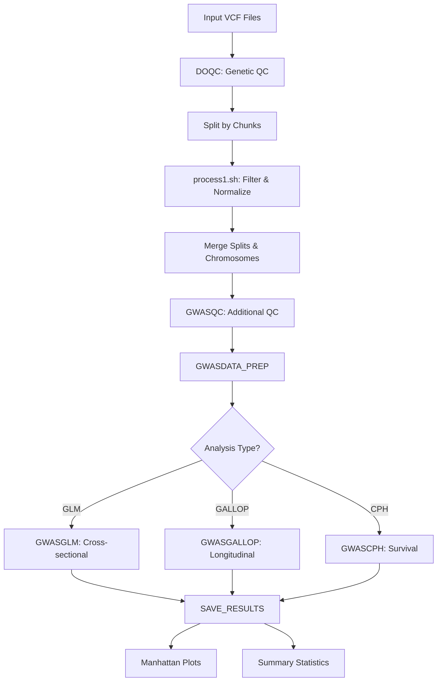

# Long-GWAS Pipeline - Repository Guide & Quick Reference

**Last Updated:** November 25, 2025  
**Version:** v2flat branch (Flattened Structure)  
**Purpose:** Complete guide to understanding the pipeline architecture, code organization, and quick troubleshooting

---

## Table of Contents
1. [Quick Reference](#quick-reference)
2. [Overview](#overview)
3. [Architecture](#architecture)
4. [Pipeline Flow](#pipeline-flow)
5. [Directory Structure](#directory-structure)
6. [Key Components](#key-components)
7. [Module Details](#module-details)
8. [Configuration](#configuration)
9. [Understanding the Code](#understanding-the-code)

---

## Quick Reference

### Common Tasks

**Run the pipeline:**
```bash
nextflow run main.nf -profile standard -params-file params.yml
```

**Debug a specific process:**
```bash
# Check process work directory
cd work/<hash>
cat .command.sh  # See exact command run
cat .command.log # See stdout/stderr
```

**Resume after failure:**
```bash
nextflow run main.nf -profile standard -params-file params.yml -resume
```

**Clear cache and restart:**
```bash
rm -rf work/
nextflow run main.nf -profile standard -params-file params.yml
```

### File Locations

| Component | Location | Purpose |
|-----------|----------|---------|
| Main entry point | `main.nf` | Pipeline orchestration |
| Process definitions | `modules/*.nf` | QC, data prep, GWAS, results |
| Helper scripts | `bin/` | Python/R/Shell scripts |
| Configuration | `nextflow.config` | Profiles and resources |
| Parameters | `params.yml` | Input files and settings |
| Reference files | Container: `/srv/GWAS-Pipeline/References` | Genome references |
| Results | `files/longGWAS_pipeline/results/` | Output directory |
| Work directory | `work/` | Process execution cache |

### Troubleshooting

**"No such file or directory" errors:**
- Check file paths are absolute or use `${projectDir}`
- Verify files exist: `ls -la example/genotype/`

**"Permission denied" on scripts:**
```bash
chmod +x bin/*.py bin/*.R bin/*.sh
```

**Docker pull issues:**
```bash
docker pull amcalejandro/longgwas:v2
```

**Profile not found:**
```bash
nextflow config -show-profiles  # List available profiles
```

**Process fails with exit code 1:**
```bash
# Find the work directory from error message
cd work/<hash>
cat .command.err  # See error details
```

---

## Overview

### What is This Pipeline?

This is a **Nextflow-based bioinformatics pipeline** for performing **Genome-Wide Association Studies (GWAS)** with support for:
- **Cross-sectional analysis** (GLM - Generalized Linear Models)
- **Longitudinal analysis** (LMM with GALLOP - Linear Mixed Models)
- **Survival analysis** (CPH - Cox Proportional Hazards)

### Key Features
- Automated genetic quality control (QC)
- Multi-threaded processing with chunking
- Containerized for reproducibility
- Caching for resume capability
- Supports multiple genome assemblies (hg18, hg19, hg38)
- **Simplified flattened structure** (v2flat): 5 module files instead of 17

### Target Users
- Genetic epidemiologists
- Bioinformaticians
- Researchers studying genetic associations with time-varying traits

---

## Architecture

### High-Level Design Pattern (v2flat - Flattened Structure)

```
┌─────────────────────────────────────────────────────────┐
│                      main.nf                            │
│         (Entry point & workflow orchestration)          │
│                                                         │
│  Pipeline Phases:                                       │
│  1. Quality Control (QC)                                │
│  2. Data Preparation                                    │
│  3. GWAS Analysis                                       │
│  4. Results Management                                  │
└──────────────────────┬──────────────────────────────────┘
                       │
                       ▼
┌─────────────────────────────────────────────────────────┐
│              modules/ (4 consolidated files)            │
│                                                         │
│  ┌───────────────────────────────────────────────────┐ │
│  │ qc.nf (4 processes)                               │ │
│  │  - GENETICQC      : Variant filtering & QC       │ │
│  │  - MERGER_SPLITS  : Merge chromosome chunks      │ │
│  │  - MERGER_CHRS    : Merge all chromosomes        │ │
│  │  - GWASQC         : Sample QC (ancestry/kinship) │ │
│  └───────────────────────────────────────────────────┘ │
│                                                         │
│  ┌───────────────────────────────────────────────────┐ │
│  │ dataprep.nf (7 processes)                         │ │
│  │  - MAKEANALYSISSETS: Extract cohorts & filter      │ │
│  │  - COMPUTE_PCA    : Principal components          │ │
│  │  - MERGE_PCA      : Merge PCA with data           │ │
│  │  - GALLOPCOX_INPUT: Prepare longitudinal/survival │ │
│  │  - RAWFILE_EXPORT : Export for GALLOP/CPH         │ │
│  │  - EXPORT_PLINK   : Export for GLM                │ │
│  └───────────────────────────────────────────────────┘ │
│                                                         │
│  ┌───────────────────────────────────────────────────┐ │
│  │ gwas.nf (3 processes)                             │ │
│  │  - GWASGLM        : Cross-sectional GWAS          │ │
│  │  - GWASGALLOP     : Longitudinal GWAS             │ │
│  │  - GWASCPH        : Survival GWAS                 │ │
│  └───────────────────────────────────────────────────┘ │
│                                                         │
│  ┌───────────────────────────────────────────────────┐ │
│  │ results.nf (2 processes)                          │ │
│  │  - SAVEGWAS       : Collect & merge results       │ │
│  │  - MANHATTAN      : Generate plots                │ │
│  └───────────────────────────────────────────────────┘ │
└─────────────────────────────────────────────────────────┘
                       │
                       ▼
┌─────────────────────────────────────────────────────────┐
│                 bin/ (Helper scripts)                   │
│  - get_phenos.py      : Extract cohorts from covariates │
│  - make_analysis_sets.py: Extract cohorts & filter      │
│  - addi_qc_pipeline.py: Ancestry & kinship QC           │
│  - glm_phenocovar.py  : GLM phenotype preparation       │
│  - gallop.py          : GALLOP wrapper                  │
│  - survival.R         : Cox proportional hazards        │
│  - manhattan.py       : Manhattan plot generation       │
│  - qc.py              : Quality control utilities       │
│  - process1.sh        : Genetic preprocessing pipeline  │
└─────────────────────────────────────────────────────────┘
```

### Why the Flattened Structure?

**Before (v2):** 17 .nf files across main.nf, workflows/, subworkflows/, and modules/
**After (v2flat):** 5 .nf files - main.nf + 4 consolidated modules

**Benefits:**
- ✅ **Simpler navigation:** Related processes grouped together
- ✅ **Easier maintenance:** One file per functional area
- ✅ **Full debugging preserved:** Process-level granularity maintained
- ✅ **Better organization:** Clear separation of pipeline phases
- ✅ **No functionality loss:** Identical behavior to v2

**Key Insight:** Nextflow debugging depends on process count, not file count. Each process still gets:
- Separate work directory with unique hash
- Independent caching for `-resume`
- Individual logs and error messages
- Process-specific resource allocation

---

## Pipeline Flow

### Complete Execution Flow



### Detailed Step-by-Step Flow

#### **Phase 1: Input & Genetic QC (DOQC)**
1. **Input Validation**
   - Read VCF files matching pattern `params.input`
   - Check for cached results from previous runs
   - Create file channels

2. **Chunking Strategy**
   - VCF files split into chunks (default: 30,000 variants)
   - Parallel processing to speed up QC
   - 5 parallel task groups to manage load

3. **Genetic QC (process1.sh)**
   - Filter PASS variants (± R² for imputed data)
   - Split multi-allelic variants
   - LiftOver to hg38 (if needed)
   - Left-normalize variants
   - Filter SNPs (MAC ≥ 2, geno < 0.05)
   - Convert to PLINK binary format

4. **Merging**
   - Merge split chunks per chromosome
   - Merge all chromosomes into genome-wide dataset

5. **Additional QC (GWASQC)**
   - Kinship filtering
   - Ancestry checks
   - Sample QC

#### **Phase 2: Data Preparation (GWASDATA_PREP)**
1. **Phenotype Processing**
   - Load phenotype file
   - Identify outliers
   - Remove outlier samples

2. **Covariate Processing**
   - Load covariates file
   - Compute PCA from genetic data
   - Merge PCA with covariates

3. **Analysis-Specific Formatting**
   - **GLM**: Export to PLINK format
   - **GALLOP/CPH**: Create special input format with time-varying data

#### **Phase 3: GWAS Execution (GWAS_RUN)**
Based on flags, run one of three analyses:

1. **GLM (Cross-sectional)**
   - Uses PLINK2 or custom GLM script
   - Tests each variant independently
   - Outputs: β, SE, p-value per variant

2. **GALLOP (Longitudinal)**
   - Linear Mixed Models
   - Accounts for repeated measures
   - Time-varying phenotypes

3. **CPH (Survival)**
   - Cox Proportional Hazards
   - Time-to-event analysis
   - Uses survival.R script

#### **Phase 4: Results Output (SAVE_RESULTS)**
1. **Collect Results**
   - Group results by phenotype
   - Merge chunks

2. **Generate Outputs**
   - Summary statistics files
   - Manhattan plots (optional)
   - QC reports

---

## Directory Structure

```
long-gwas-pipeline/
│
├── main.nf                    # Entry point
├── nextflow.config            # Configuration
├── params.yml                 # Parameter file (YAML)
├── Dockerfile                 # Container definition
├── README.md                  # Basic documentation
│
├── workflows/
│   └── gwas.nf               # Main workflow coordinator
│
├── subworkflows/             # Composite workflows
│   ├── fullqc.nf            # Genetic QC workflow
│   ├── gwasinputs.nf        # Data prep workflow
│   ├── rungwas.nf           # GWAS execution workflow
│   └── saveresults.nf       # Results export workflow
│
├── modules/                  # Individual process definitions
│   ├── geneticqc/
│   │   ├── qc.nf           # Genetic QC process (calls process1.sh)
│   │   └── merge.nf        # Merge splits/chromosomes
│   ├── gwasprep/
│   │   ├── covars.nf       # PCA computation
│   │   ├── gallopcph_in.nf # Format for GALLOP/CPH
│   │   ├── outliers_exclude.nf # Outlier removal
│   │   └── raw.nf          # Export raw files
│   ├── gwasqc/
│   │   └── main.nf         # Additional QC (kinship, ancestry)
│   ├── gwasrun/
│   │   ├── glm.nf          # GLM analysis
│   │   ├── gallop.nf       # GALLOP analysis
│   │   └── cph.nf          # CPH analysis
│   └── resultsout/
│       ├── gwasfiles.nf    # Export results
│       └── manhattan.nf    # Manhattan plots
│
├── bin/                      # Helper scripts (executable)
│   ├── process1.sh          # Main genetic preprocessing
│   ├── qc.py                # Python QC script
│   ├── glm_phenocovar.py    # GLM helper
│   ├── survival.R           # R survival analysis
│   ├── addi_qc_pipeline.py  # Additional QC
│   └── *.zip                # Bundled tools (PLINK, GCTA)
│
├── example/                  # Example data
│   ├── covariates.tsv
│   ├── phenotype.*.tsv
│   └── genotype/
│       └── example.vcf.tar.gz
│
├── References/               # Reference data
│   └── ancestry_ref_panel.tar.gz
│
└── docs/                     # Documentation
    ├── getting_started.md
    ├── parameters.md
    ├── file_formats.md
    └── ...
```

---

## Key Components

### 1. main.nf
**Purpose:** Entry point for the pipeline

**What it does:**
- Enables Nextflow DSL2
- Imports the main `GWAS` workflow
- Wraps it in `LONGWAS` workflow
- Provides default entry point

**Key code:**
```groovy
include { GWAS } from './workflows/gwas'

workflow LONGWAS {
    GWAS ()
}

workflow {
    LONGWAS ()  // Default entry
}
```

### 2. workflows/gwas.nf
**Purpose:** Main workflow coordinator

**What it does:**
- Determines analysis type (GLM/GALLOP/CPH)
- Creates input channels
- Orchestrates 4 subworkflows
- Prints pipeline parameters

**Key sections:**
```groovy
// Determine model type
if (params.longitudinal_flag) {
    MODEL = "lmm_gallop"
} else if (params.survival_flag) {
    MODEL = "cph"
} else {
    MODEL = "glm"
}

// Main workflow
workflow GWAS {
    DOQC(input_check_ch, cache)
    GWASDATA_PREP(params.covarfile, DOQC)
    GWAS_RUN(params.phenofile, phenonames, GWASDATA_PREP.out)
    SAVE_RESULTS(GWAS_RUN.out, MODEL)
}
```

### 3. subworkflows/fullqc.nf
**Purpose:** Genetic quality control

**What it does:**
- Splits VCF files into chunks
- Runs `GENETICQC` process on each chunk (parallel)
- Merges split chunks
- Merges chromosomes
- Runs additional QC (kinship, ancestry)

**Key features:**
- **Parallel chunking**: 5 task groups process simultaneously
- **Caching**: Skips already processed chunks
- **Smart merging**: First merges splits, then chromosomes

**Flow:**
```
VCF files → Split into chunks → GENETICQC (parallel)
          → Merge splits per chr → Merge chromosomes
          → GWASQC (kinship/ancestry)
```

### 4. subworkflows/gwasinputs.nf
**Purpose:** Prepare data for GWAS

**What it does:**
- Loads phenotypes and identifies outliers
- Computes PCA from genetic data
- Merges PCA with covariates
- Formats data based on analysis type

**Branching logic:**
```groovy
if (params.longitudinal_flag | params.survival_flag) {
    GALLOPCOX_INPUT(...)  // Special format for LMM/survival
} else {
    EXPORT_PLINK(...)     // PLINK format for GLM
}
```

### 5. subworkflows/rungwas.nf
**Purpose:** Execute GWAS analysis

**What it does:**
- Routes to appropriate analysis based on flags
- Collects results by phenotype
- Groups results for output

**Analysis routing:**
```groovy
if (params.longitudinal_flag) {
    GWASGALLOP(...)
} else if (params.survival_flag) {
    GWASCPH(...)
} else {
    GWASGLM(...)
}
```

### 6. modules/geneticqc/qc.nf
**Purpose:** Core genetic QC process

**What it does:**
- Calls `process1.sh` script
- Handles VCF chunk headers
- Converts to BED format

**Critical script:** `bin/process1.sh`
```bash
# process1.sh performs:
# 1. PASS/R² filtering
# 2. Multi-allelic split
# 3. LiftOver to hg38
# 4. Left-normalization
# 5. SNP filtering (MAC, geno)
# 6. REF/ALT alignment
# 7. Duplicate removal
```

### 7. bin/process1.sh
**Purpose:** Genetic data preprocessing workhorse

**The most complex script in the pipeline!**

**Input:** VCF file (any assembly, genotyped or imputed)  
**Output:** PLINK binary files (.bed/.bim/.fam)

**What it does (in order):**
1. **Filter PASS variants**
   - For imputed: Also filter R² > threshold
   - For genotyped: Just PASS filter

2. **Split multi-allelic variants**
   - Biallelic representation

3. **LiftOver** (if needed)
   - hg18/hg19 → hg38 coordinate conversion

4. **Left-normalization**
   - Standardize variant representation using reference

5. **SNP filtering**
   - Only keep ACGT SNPs
   - MAC ≥ 2 (remove singletons)

6. **REF/ALT alignment**
   - Align to hg38 reference
   - Remove provisional variants

7. **Final QC**
   - Rename to chr:pos:ref:alt format
   - Remove duplicates
   - Filter by genotype missingness (< 5%)

**Tools used:**
- bcftools (filtering, splitting, normalization)
- liftOver (coordinate conversion)
- plink2 (format conversion, QC)

---

## Data Flow Diagram

### Input Files
```
Input VCF Files (*.vcf or *.vcf.gz)
├─ Chromosome-specific files (chr1.vcf, chr2.vcf, ...)
├─ Can be genotyped or imputed
└─ Any assembly (hg18, hg19, hg38)

Phenotype File (TSV)
├─ Required columns: ID, phenotype, time (for longitudinal)
├─ Format depends on analysis type
└─ Example: phenotype.surv.tsv, phenotype.cs.tsv

Covariate File (TSV)
├─ Required columns: ID, covariates
├─ Example: SEX, age_at_baseline
└─ PCA components added automatically
```

### Intermediate Files (Cached)
```
files/longGWAS_pipeline/results/cache/{dataset}/
├─ p1_run_cache/          # Processed chunks from process1.sh
│  ├─ chr1.1_p1out.{pgen,pvar,psam}
│  ├─ chr1.2_p1out.{pgen,pvar,psam}
│  └─ ...
├─ merged_splits/         # Merged chunks per chromosome
├─ merged_chrs/           # Merged all chromosomes
└─ qc_output/             # QC results
```

### Output Files
```
results/
├─ gwas_results_{phenotype}.tsv   # Association results
├─ manhattan_{phenotype}.png       # Manhattan plot (optional)
└─ qc_summary.txt                  # QC report
```

---

## Module Details

### geneticqc/qc.nf - GENETICQC Process

**Input:**
- `vSimple`: Simple filename (e.g., "chr21")
- `fOrig`: Original VCF file
- `fSplit`: Chunked VCF file

**Output:**
- BED/BIM/FAM files (PLINK binary format)
- Chunk name for merging

**Script logic:**
```groovy
// Extract chromosome number from filename
chrnum = vSimple =~ /(?i)(chr)([0-9]+)/

// For non-first chunks, add VCF header
if (chunk != 1) {
    bcftools view -h $original | cat - $chunk > tmp_input
}

// Call process1.sh
process1.sh $threads $input $r2thres $assembly $chrnum $prefix

// Convert to BED format
plink2 --pfile output --make-bed --out final
```

### gwasprep/covars.nf - PCA Computation

**COMPUTE_PCA Process:**
- Takes QC'd genetic data
- Runs PCA (usually 10 components)
- Output: eigenvectors for each sample

**MERGE_PCA Process:**
- Merges PCA eigenvectors from all chunks
- Creates combined PCA file
- Used as covariates in GWAS

### gwasrun/*.nf - GWAS Analyses

**Three parallel implementations:**

1. **glm.nf** - Uses PLINK2 or custom GLM
2. **gallop.nf** - Longitudinal mixed models
3. **cph.nf** - Survival analysis with R

**All follow same pattern:**
```groovy
process GWAS_ANALYSIS {
    input:
        // Genetic data chunks
        // Phenotype file
        // Covariate file
    
    output:
        // Results per chunk
    
    script:
        // Run appropriate analysis
        // Parse results
        // Format output
}
```

---

## Configuration

### nextflow.config

**Key parameters:**
```groovy
params {
    // Input files
    input = "path/to/*.vcf"
    covarfile = "covariates.tsv"
    phenofile = "phenotype.tsv"
    
    // Variable names
    pheno_name = 'y'
    covariates = 'SEX age_at_baseline'
    time_col = 'study_days'
    
    // Analysis flags
    longitudinal_flag = false
    survival_flag = false
    linear_flag = true
    
    // Chunking
    chunk_size = 30000
    
    // QC thresholds
    r2thres = -9              # -9 for genotyped, 0.3-0.8 for imputed
    minor_allele_freq = '0.05'
    kinship = '0.177'
    ancestry = 'EUR'
    assembly = 'hg19'
    
    // Output
    dataset = 'TEST'          # Identifier for caching
    mh_plot = true
}

// Profiles
profiles {
    standard {
        container = 'amcalejandro/longgwas:v2'
        cpus = 2
        memory = '6 GB'
    }
}
```

### params.yml

Alternative parameter specification:
```yaml
input: /path/to/genotype/chr[1-3].vcf
covarfile: /path/to/covariates.tsv
phenofile: /path/to/phenotype.tsv

pheno_name: surv_y
covariates: "SEX age_at_baseline"
time_col: study_days

longitudinal_flag: false
survival_flag: true
linear_flag: false

r2thres: -9
minor_allele_freq: "0.05"
kinship: "0.177"
ancestry: "EUR"
assembly: "hg19"
dataset: "MYSTUDY"
```

---

## Understanding the Code

### Nextflow Patterns Used

#### 1. **Channel Operations**
```groovy
// Create channel from files
Channel.fromPath(params.input)

// Transform with map
.map{ f -> tuple(f.getSimpleName(), f) }

// Split and process
.splitText(by: params.chunk_size, file: true)

// Join channels
.join(cache, remainder: true)

// Group results
.groupTuple(sort: true)
```

#### 2. **Process Definition**
```groovy
process NAME {
    label 'medium'        // Resource label
    
    input:
        tuple val(x), path(file)
    
    output:
        path("output.txt")
    
    script:
    """
    command $x $file > output.txt
    """
}
```

#### 3. **Workflow Composition**
```groovy
workflow SUBWORKFLOW {
    take:
        input_data
    
    main:
        PROCESS1(input_data)
        PROCESS2(PROCESS1.out)
    
    emit:
        result = PROCESS2.out
}
```

### Key Nextflow Concepts

**Channels:**
- Asynchronous FIFO queues
- Connect processes
- Can be forked, joined, merged

**Processes:**
- Atomic tasks
- Execute in isolation
- Automatically parallelized

**Workflows:**
- Compose processes
- Define data flow
- Reusable

**Caching:**
- Based on input hash
- Resume failed runs
- Skip completed tasks

---

## Common Patterns in This Pipeline

### Pattern 1: Cached Processing
```groovy
// Check cache first
Channel.fromPath("${CACHE_DIR}/*")
    .join(input, remainder: true)
    .filter{ name, file, cache -> cache == null }
    // Only process if not cached
```

### Pattern 2: Parallel Chunking
```groovy
// Split into 5 parallel task groups
.branch {
    group1: idx <= 5
    group2: idx > 5 && idx <= 10
    group3: idx > 10 && idx <= 14
    group4: idx > 14 && idx <= 18
    group5: true
}
// Each group processed independently
```

### Pattern 3: Conditional Workflow
```groovy
if (params.longitudinal_flag) {
    GWASGALLOP(...)
    RESULTS = GWASGALLOP.out
} else if (params.survival_flag) {
    GWASCPH(...)
    RESULTS = GWASCPH.out
} else {
    GWASGLM(...)
    RESULTS = GWASGLM.out
}
```

### Pattern 4: Multi-Stage Merging
```groovy
// First merge splits within chromosome
MERGER_SPLITS(chunks_per_chr)

// Then merge all chromosomes
MERGER_CHRS(all_chr_merged)
```

---

## Summary for Refactoring

### What You Should Know Before Refactoring

1. **Critical Path:**
   - `process1.sh` is the bottleneck and most complex component
   - It's called by `modules/geneticqc/qc.nf`
   - Splitting this improves testability and maintainability

2. **Caching is Important:**
   - Don't break the caching mechanism
   - Output filenames matter for cache lookup

3. **Parallel Processing:**
   - Chunking enables parallelization
   - Each chunk must be independent

4. **Three Analysis Types:**
   - GLM, GALLOP, CPH have different data requirements
   - Data prep diverges based on `params.*_flag`

5. **File Format Transitions:**
   ```
   VCF → PGEN → BED → Analysis-specific format
   ```

### Recommended Refactoring Approach

1. **Start with `process1.sh`:**
   - Already identified as needing modularization
   - Has clear logical sections
   - Doesn't affect other components initially

2. **Keep interfaces stable:**
   - Input: VCF file
   - Output: BED/BIM/FAM files
   - Intermediate steps can change

3. **Add intermediate outputs:**
   - Helps debugging
   - Enables partial re-runs
   - Creates testable units

4. **Consider data type variations:**
   - Genotyped vs imputed
   - Different assemblies
   - Hard-calls vs dosage

### Testing Strategy

1. **Unit test each module:**
   - Small test VCF
   - Known good output
   - Edge cases

2. **Integration test:**
   - Full chromosome
   - Compare with original output

3. **End-to-end test:**
   - Complete pipeline
   - Example data
   - Validate results

---

## Questions to Answer Before Refactoring

1. **Which components are most brittle?**
   - `process1.sh` - monolithic, hard to debug
   - Chunking logic - complex branching

2. **What breaks most often?**
   - Reference mismatches in normalization
   - LiftOver failures
   - Memory issues with large VCFs

3. **What's hardest to test?**
   - End-to-end pipeline
   - Conditional logic branches
   - Cached vs non-cached paths

4. **What would improve maintainability most?**
   - Modular `process1.sh`
   - Better error messages
   - Intermediate file retention (optional)
   - Documentation of expected formats

---

## Glossary

**Terms used in this pipeline:**

- **VCF**: Variant Call Format - standard genetic variant file
- **PGEN**: PLINK2 binary format (.pgen/.pvar/.psam)
- **BED**: PLINK binary format (.bed/.bim/.fam)
- **MAF**: Minor Allele Frequency
- **MAC**: Minor Allele Count
- **R²**: Imputation quality score (0-1)
- **QC**: Quality Control
- **PCA**: Principal Component Analysis (for ancestry)
- **GLM**: Generalized Linear Model
- **LMM**: Linear Mixed Model
- **CPH**: Cox Proportional Hazards
- **GWAS**: Genome-Wide Association Study
- **SNP**: Single Nucleotide Polymorphism
- **LiftOver**: Coordinate conversion between genome assemblies
- **Normalization**: Standardizing variant representation

---

## Next Steps

Now that you understand the repository structure:

1. ✅ **Read this document thoroughly**
2. ⏭️ **Review `bin/process1.sh` in detail** (main refactoring target)
3. ⏭️ **Trace one example through the pipeline**
4. ⏭️ **Identify specific pain points**
5. ⏭️ **Design modular solution**
6. ⏭️ **Implement incrementally**
7. ⏭️ **Test at each step**

**Good luck with your refactoring!** 🚀
